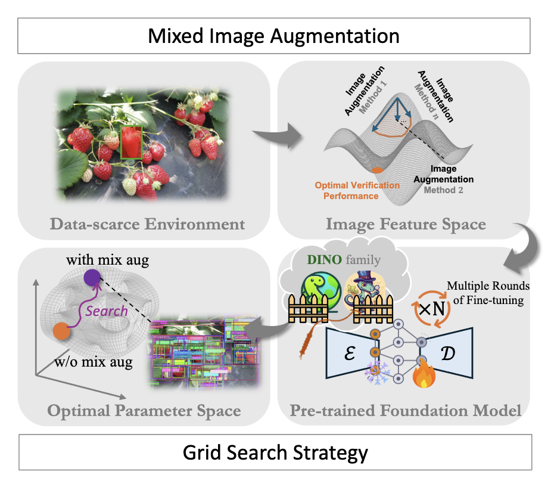
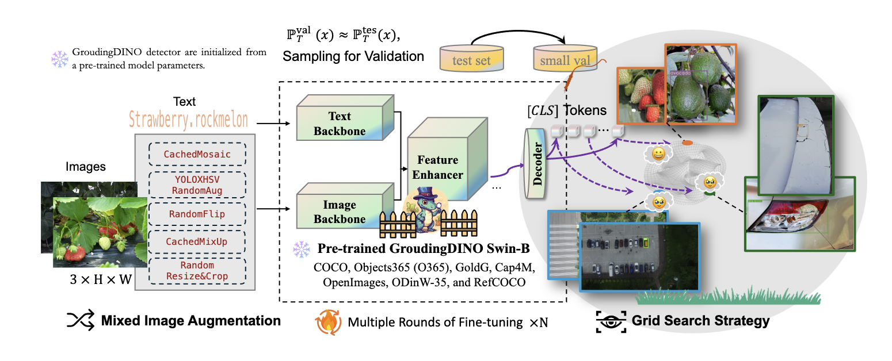

# 🥈 NTIRE 2025 CD-FSOD Challenge @ CVPR Workshop

We are the **AI4EarthLab team** of the **NTIRE 2025 Cross-Domain Few-Shot Object Detection (CD-FSOD) Challenge** at the **CVPR Workshop**.

- 🏆 **Track**: `open-source track`
- 🎖️ **Award**: **2nd Place**
- 🧰 **Method**: *Enhance Then Search: An Augmentation-Search Strategy with Foundation Models for Cross-Domain Few-Shot Object Detection*

🔗 [NTIRE 2025 Official Website](https://cvlai.net/ntire/2025/)  
🔗 [NTIRE 2025 Challenge Website](https://codalab.lisn.upsaclay.fr/competitions/21851)  
🔗 [CD-FSOD Challenge Repository](https://github.com/lovelyqian/NTIRE2025_CDFSOD)

<p align="center">
    
</p>

[](https://paperswithcode.com/sota/cross-domain-few-shot-object-detection-on?p=enhance-then-search-an-augmentation-search)	
[](https://paperswithcode.com/sota/cross-domain-few-shot-object-detection-on-1?p=enhance-then-search-an-augmentation-search)
[](https://paperswithcode.com/sota/cross-domain-few-shot-object-detection-on-3?p=enhance-then-search-an-augmentation-search)
[](https://paperswithcode.com/sota/cross-domain-few-shot-object-detection-on-2?p=enhance-then-search-an-augmentation-search)
[](https://paperswithcode.com/sota/cross-domain-few-shot-object-detection-on-neu?p=enhance-then-search-an-augmentation-search)
[](https://paperswithcode.com/sota/cross-domain-few-shot-object-detection-on-4?p=enhance-then-search-an-augmentation-search)

---

## 📰 News
- [2025.4] 🎉 Update the leaderboards on Paper With Code: [Cross-Domain Few-Shot Object Detection](https://paperswithcode.com/task/cross-domain-few-shot-object-detection/latest) based on open-source settings.
- [2025.4] 🎉 Release the paper "Enhance Then Search: An Augmentation-Search Strategy with Foundation Models for Cross-Domain Few-Shot Object Detection" in [arXiv](https://arxiv.org/abs/2504.04517).
- [2025.4] 🎉 Release the **ETS** code based on GroundingDINO Swin-B.
- [2025.3] 🎉 Win the **2nd Place** in the NTIRE 2025 CD-FSOD Challenge, CVPR2025.

## 🧠 Overview

This repository contains our solution for the `open-source track` of the NTIRE 2025 CD-FSOD Challenge.  
We propose a method that integrates **dynamic mixed image augmentation with efficient grid-based sub-domain search strategy**, which achieves strong performance on the challenge. 

<p align="center">
    
</p>


<p align="center">
    
</p>

---

## 🛠️ Environment Setup

The experimental environment is based on [mmdetection](https://github.com/open-mmlab/mmdetection/blob/main/docs/zh_cn/get_started.md), the installation environment reference mmdetection's [installation guide](https://github.com/open-mmlab/mmdetection/blob/main/docs/zh_cn/get_started.md).

```bash
conda create --name ets python=3.8 -y
conda activate ets
cd ./mmdetection
pip3 install torch==1.10.0+cu113 torchvision==0.11.1+cu113 torchaudio==0.10.0+cu113 -f https://download.pytorch.org/whl/cu113/torch_stable.html
pip install -U openmim
mim install mmengine
mim install "mmcv>=2.0.0"

# Develop and run directly mmdet
pip install -v -e .
pip install -r requirements/multimodal.txt
pip install emoji ddd-dataset
pip install git+https://github.com/lvis-dataset/lvis-api.git
```
Then download the BERT weights `bert-base-uncased` into the weights directory,
```bash
cd ETS/
huggingface-cli download --resume-download google-bert/bert-base-uncased --local-dir weights/bert-base-uncased
```


## 📂 Dataset Preparation
Please follow the instructions in the [official CD-FSOD repo](https://github.com/lovelyqian/NTIRE2025_CDFSOD) to download and prepare the dataset.

```bash
.
├── configs
├── data
├── LICENSE
├── mmdetection
├── pkl2coco.py
├── pkls
├── README.md
├── submit
├── submit_codalab
└── weights
```

## 🏋️ Training

Mix Image Augmentation Config

```python
train_pipeline = [
    dict(type='LoadImageFromFile', backend_args=backend_args),
    dict(type='LoadAnnotations', with_bbox=True),
    dict(type='CachedMosaic', img_scale=(640, 640), pad_val=114.0, prob=0.6),
    # dict(type='CopyPaste', max_num_pasted=5, paste_by_box=True),  # 添加 CopyPaste 数据增强
    dict(type='YOLOXHSVRandomAug'),
    dict(type='RandomFlip', prob=0.5),
    dict(
        type='CachedMixUp',
        img_scale=(640, 640),
        ratio_range=(1.0, 1.0),
        max_cached_images=10,
        pad_val=(114, 114, 114),
        prob = 0.3),
    dict(
        type='RandomChoice',
        transforms=[
            [
                dict(
                    type='RandomChoiceResize',
                    scales=[(480, 1333), (512, 1333), (544, 1333), (576, 1333),
                            (608, 1333), (640, 1333), (672, 1333), (704, 1333),
                            (736, 1333), (768, 1333), (800, 1333)],
                    keep_ratio=True)
            ],
            [
                dict(
                    type='RandomChoiceResize',
                    # The radio of all image in train dataset < 7
                    # follow the original implement
                    scales=[(400, 4200), (500, 4200), (600, 4200)],
                    keep_ratio=True),
                dict(
                    type='RandomCrop',
                    crop_type='absolute_range',
                    crop_size=(384, 600),
                    allow_negative_crop=True),
                dict(
                    type='RandomChoiceResize',
                    scales=[(480, 1333), (512, 1333), (544, 1333), (576, 1333),
                            (608, 1333), (640, 1333), (672, 1333), (704, 1333),
                            (736, 1333), (768, 1333), (800, 1333)],
                    keep_ratio=True)
            ]
        ]),
    # dict(type='RandomErasing', n_patches=(0,2), ratio=0.3, img_border_value=128, bbox_erased_thr=0.9),
    dict(
        type='PackDetInputs',
        meta_keys=('img_id', 'img_path', 'ori_shape', 'img_shape',
                   'scale_factor', 'flip', 'flip_direction', 'text',
                   'custom_entities'))
]

```


To train the model: 

50 groups of experiments were carried out on the 8 x A100, a total of 50 x 8 groups of experiments.

```bash
cd ./mmdetection

./tools/dist_train_muti.sh configs/grounding_dino/CDFSOD/GroudingDINO-few-shot-SwinB.py "0,1,2,3,4,5,6,7" 50
```
use `sampling4val.py` for sampling test set for validation set.

use `sata_logs` for search to get best model parameter from train logs.

pretrained model: 

Download the checkpoint files to dir `./weights`.
> Baidu Disk: [[link]](https://pan.baidu.com/s/17wECMZ7X-wkFMXSCQ_SvAw?pwd=ttu)
or
> 通过网盘分享的文件：weights
链接: https://pan.baidu.com/s/17wECMZ7X-wkFMXSCQ_SvAw?pwd=ttue 提取码: ttue 
--来自百度网盘超级会员v6的分享

## 🔍 Inference & Evaluation

Run evaluation:

```bash
cd ./mmdetection

bash tools/dist_test.sh configs/grounding_dino/CDFSOD/GroudingDINO-few-shot-SwinB.py /path/to/model/ 4
```

Run inference:

Save to `*.pkl` file and convert to submit `.json` format.
```bash
cd ./mmdetection

## 1-shot-dataset1
bash tools/dist_test_out.sh ../configs/1-shot-dataset1.py ../weights/1-shot-dataset1-db4c5ebf.pth 1 ../pkls/dataset1_1shot.pkl

python ../pkl2coco.py --coco_file ../data/dataset1/annotations/test.json --pkl_file ../pkls/dataset1_1shot.pkl --output_json ../pkls/dataset1_1shot_coco.json --annotations_json ../submit/dataset1_1shot.json

## 1-shot-dataset2
bash tools/dist_test_out.sh ../configs/1-shot-dataset2.py ../weights/1-shot-dataset2-0bd5d280.pth 1 ../pkls/dataset2_1shot.pkl

python ../pkl2coco.py --coco_file ../data/dataset2/annotations/test.json --pkl_file ../pkls/dataset2_1shot.pkl --output_json ../pkls/dataset2_1shot_coco.json --annotations_json ../submit/dataset2_1shot.json

## 1-shot-dataset3
bash tools/dist_test_out.sh ../configs/1-shot-dataset3.py ../weights/1-shot-dataset3-433149f8.pth 1 ../pkls/dataset3_1shot.pkl

python ../pkl2coco.py --coco_file ../data/dataset3/annotations/test.json --pkl_file ../pkls/dataset3_1shot.pkl --output_json ../pkls/dataset3_1shot_coco.json --annotations_json ../submit/dataset3_1shot.json

## 5-shot-dataset1
bash tools/dist_test_out.sh ../configs/5-shot-dataset1.py ../weights/5-shot-dataset1-ad2ac5f0.pth 1 ../pkls/dataset1_5shot.pkl

python ../pkl2coco.py --coco_file ../data/dataset1/annotations/test.json --pkl_file ../pkls/dataset1_5shot.pkl --output_json ../pkls/dataset1_5shot_coco.json --annotations_json ../submit/dataset1_5shot.json

## 5-shot-dataset2
bash tools/dist_test_out.sh ../configs/5-shot-dataset2.py ../weights/5-shot-dataset2-0bfccba8.pth 1 ../pkls/dataset2_5shot.pkl

python ../pkl2coco.py --coco_file ../data/dataset2/annotations/test.json --pkl_file ../pkls/dataset2_5shot.pkl --output_json ../pkls/dataset2_5shot_coco.json --annotations_json ../submit/dataset2_5shot.json

## 5-shot-dataset3
bash tools/dist_test_out.sh ../configs/5-shot-dataset3.py ../weights/5-shot-dataset3-0011f4b1.pth 1 ../pkls/dataset3_5shot.pkl

python ../pkl2coco.py --coco_file ../data/dataset3/annotations/test.json --pkl_file ../pkls/dataset3_5shot.pkl --output_json ../pkls/dataset3_5shot_coco.json --annotations_json ../submit/dataset3_5shot.json

## 10-shot-dataset1
bash tools/dist_test_out.sh ../configs/10-shot-dataset1.py ../weights/10-shot-dataset1-33caf03b.pth 1 ../pkls/dataset1_10shot.pkl

python ../pkl2coco.py --coco_file ../data/dataset1/annotations/test.json --pkl_file ../pkls/dataset1_10shot.pkl --output_json ../pkls/dataset1_10shot_coco.json --annotations_json ../submit/dataset1_10shot.json

## 10-shot-dataset2
bash tools/dist_test_out.sh ../configs/10-shot-dataset2.py ../weights/10-shot-dataset2-46b5584c.pth 1 ../pkls/dataset2_10shot.pkl

python ../pkl2coco.py --coco_file ../data/dataset2/annotations/test.json --pkl_file ../pkls/dataset2_10shot.pkl --output_json ../pkls/dataset2_10shot_coco.json --annotations_json ../submit/dataset2_10shot.json

## 10-shot-dataset3
bash tools/dist_test_out.sh ../configs/10-shot-dataset3.py ../weights/10-shot-dataset3-7325994e.pth 1 ../pkls/dataset3_10shot.pkl

python ../pkl2coco.py --coco_file ../data/dataset3/annotations/test.json --pkl_file ../pkls/dataset3_10shot.pkl --output_json ../pkls/dataset3_10shot_coco.json --annotations_json ../submit/dataset3_10shot.json
```

## 🧪 CD-FSOD Benchmark Reproduction (ETS as Baseline)

This section documents how to use **ETS as a baseline** on the public
**[CDFSOD-benchmark](./CDFSOD-benchmark/)** (Fu et al., ECCV 2024) for
direct comparison against CD-ViTO / DE-ViT-FT and other methods. All
six target datasets and three k-shot settings are supported out of the
box.

### Datasets

The 6 standard datasets are already included under `datasets/`:

| key       | name        | classes | source                |
|-----------|-------------|---------|-----------------------|
| `artaxor` | ArTaxOr     | 7       | invertebrates         |
| `clipart1k` | Clipart1k | 20      | non-photorealistic    |
| `dior`    | DIOR        | 20      | aerial / remote-sense |
| `fish`    | FISH        | 1       | underwater            |
| `neu-det` | NEU-DET     | 6       | industrial defects    |
| `uodd`    | UODD        | 3       | underwater            |

Each dataset already ships `annotations/{1,5,10}_shot.json` and a
common `annotations/test.json`, matching the CDFSOD-benchmark splits.

### Configs

Two parallel sets of configs are auto-generated by the generator:

- `configs/cdfsod/<dataset>/<shot>shot_baseline.py`
  → minimal augmentation (RandomFlip + multi-scale resize). Used to
  report ETS numbers under a regime comparable to other CD-FSOD
  methods (CD-ViTO, DE-ViT-FT, etc.).
- `configs/cdfsod/<dataset>/<shot>shot_ets.py`
  → full ETS pipeline (CachedMosaic + CachedMixUp + YOLOXHSV +
  multi-scale). Used to report ETS's best achievable numbers.

Both variants share the same backbone (GroundingDINO Swin-B) and BERT
language model, so any difference comes purely from the data-side
strategy.

To regenerate them after editing `configs/cdfsod/_dataset_meta.py`:

```bash
python tools/gen_cdfsod_configs.py
```

### Reproduction modes

Three launchers are provided.  **For first-time use, prefer the unified
launcher (`tools/start_experiments.sh`)** -- it runs pre-flight checks,
prints a plan, asks for confirmation, then dispatches to mode A or B
below in the background:

```bash
# default: both variants, all datasets/shots, GPUs 1,2,3,4, sequential, BG
bash tools/start_experiments.sh

# subset / customised
bash tools/start_experiments.sh --variants ets --gpus 0,1,2,3
bash tools/start_experiments.sh --datasets neu-det --shots 5 --smoke

# parallel mode (one task per GPU)
bash tools/start_experiments.sh --mode parallel

# preview only (no launch)
bash tools/start_experiments.sh --dry-run

# skip confirmation (CI-friendly)
bash tools/start_experiments.sh --yes
```

Logs go to `runner_logs/runner_<TIMESTAMP>.log`; the launcher PID is
saved next to it for easy `kill`.  After launch the script prints a
cheat-sheet for monitoring, killing, and running PoE inference once the
first checkpoint appears.


#### Mode A. Distributed (multi-GPU per task, sequential across tasks)

Mirrors `CDFSOD-benchmark/main_results.sh` exactly: each experiment is
trained with N GPUs (default N=4) using `torch.distributed.launch`,
and the 36 experiments run one after another.

```bash
# both variants, all 6 datasets x 3 shots = 36 runs (4 GPUs each)
bash main_results_cdfsod.sh

# only the fair-comparison baseline
bash main_results_cdfsod.sh baseline

# only the full ETS variant, 8 GPUs
GPUS=8 GPU_IDS=0,1,2,3,4,5,6,7 bash main_results_cdfsod.sh ets

# subset for quick smoke test
DATASETS="neu-det uodd" SHOTS="5" bash main_results_cdfsod.sh baseline
```

#### Mode B. Parallel (one task per GPU, queue the rest)

Best when you have a small fixed pool of GPUs and want to maximise
throughput by running independent experiments in parallel. A worker
thread per GPU pulls the next pending experiment from a FIFO queue.

```bash
# default: cards 1,2,3,4, both variants, all datasets/shots
python tools/run_parallel_cdfsod.py

# only baseline variant on cards 1,2,3,4 (recommended for first pass)
python tools/run_parallel_cdfsod.py --gpus 1,2,3,4 --variants baseline

# subset for a smoke test
python tools/run_parallel_cdfsod.py --datasets neu-det uodd --shots 5

# preview the commands without running
python tools/run_parallel_cdfsod.py --print-only

# fully detached background launch
nohup python tools/run_parallel_cdfsod.py --gpus 1,2,3,4 \
    > parallel_runner.log 2>&1 &
tail -f parallel_runner.log
```

Per-experiment outputs (both modes) live at:

```
mmdetection/work_dirs/cdfsod/<variant>/<dataset>_<shot>shot/
                                                  └── train.log    # full mmdet stdout
                                                  └── <ts>/vis_data/scalars.json  # metrics
```

### Aggregate results

After (or during) training, build the comparison tables:

```bash
python summarize_results.py
# -> cdfsod_results.csv     (one row per experiment)
# -> cdfsod_results.md      (markdown tables, one per variant)
```

The Markdown report follows the same shape as Tab.2 of the
CDFSOD-benchmark paper (rows = datasets, columns = 1/5/10-shot mAP),
making it drop-in for paper comparison tables.

### Differences vs the original ETS challenge submission

| aspect                | NTIRE 2025 submission | this benchmark setup |
|-----------------------|-----------------------|----------------------|
| Datasets              | 3 private (`dataset1/2/3`) | 6 public CD-FSOD targets |
| Augmentation search   | 50 groups x 8 GPUs grid    | single training run |
| Epochs                | up to 1000              | 50 (both variants)       |
| Validation set        | sampled subset of test   | the official `test.json` |
| Purpose               | win the challenge        | fair, reproducible comparison |


### 🎯 Product-of-Experts (PoE) inference (optional)

Inspired by Ong et al., *"Fixing Background Misclassification in Few-Shot
Object Detection via Product of Experts"* (TPAMI 2026), we provide an
**inference-only** PoE-style score-fusion that combines:

- the **fine-tuned ETS** GroundingDINO (the "novel expert") and
- the **un-fine-tuned pretrained** GroundingDINO Swin-B
  (`groundingdino_swinb_cogcoor_mmdet-55949c9c.pth`, the "base expert").

For every detection produced by the fine-tuned model, the strongest
overlapping detection (by IoU, label-agnostic) from the pretrained model
is treated as a class-agnostic *objectness / known-pattern* signal. The
two scores are combined under a log-linear PoE rule:

```
log s_fused = (1 - alpha) * log s_ft + alpha * log s_pre
```

No retraining, no extra parameters; just two forward passes per image.

Run on a single experiment:

```bash
# example: NEU-DET 5-shot ETS, alpha=0.3, true PoE
python tools/poe_inference.py \
    --ft-config  configs/cdfsod/neu-det/5shot_ets.py \
    --ft-ckpt   "mmdetection/work_dirs/cdfsod/ets/neu-det_5shot/best_*.pth" \
    --test-ann   datasets/NEU-DET/annotations/test.json \
    --img-prefix datasets/NEU-DET/test \
    --alpha      0.3 \
    --mode       log_linear \
    --also-baseline \
    --out        work_dirs/cdfsod/poe/ets/neu-det_5shot/predictions.json

# evaluate (also prints per-class AP and PoE - baseline diff)
python tools/poe_eval.py \
    --gt            datasets/NEU-DET/annotations/test.json \
    --pred          work_dirs/cdfsod/poe/ets/neu-det_5shot/predictions.json \
    --baseline-pred work_dirs/cdfsod/poe/ets/neu-det_5shot/predictions_ft_only.json
```

Or sweep all available fine-tuned ckpts and aggregate results into a
Markdown / CSV summary:

```bash
# default: every ckpt found, both variants, alpha=0.3, log_linear PoE
python tools/poe_run_all.py

# alpha sweep on a single dataset
python tools/poe_run_all.py --datasets neu-det --shots 5 \
    --alphas 0.1 0.3 0.5 0.7 --also-baseline

# preview commands without executing
python tools/poe_run_all.py --print-only
```

Outputs go to `work_dirs/cdfsod/poe/<variant>/<dataset>_<shot>shot/alpha*_<mode>/`,
with a top-level `poe_summary.{csv,md}` aggregator.

Available fusion modes:

| `--mode`         | formula                                                | use case                          |
|------------------|--------------------------------------------------------|-----------------------------------|
| `log_linear` ⭐  | `s_ft^(1-α) * s_pre^α`                                  | true PoE; default; aligned w/ paper|
| `multiplicative` | `s_ft * (1 + α * s_pre)`                                | gentler boost                     |
| `additive`       | `(1-α) * s_ft + α * s_pre`                              | mixture-of-experts, NOT PoE       |
| `gated`          | `s_ft + α * 1[s_pre>τ] * s_pre`                         | only fuse when pretrained agrees  |


## 📄 Citation
If you use our method or codes in your research, please cite:
```
@inproceedings{fu2025ntire, 
  title={NTIRE 2025 challenge on cross-domain few-shot object detection: methods and results},
  author={Fu, Yuqian and Qiu, Xingyu and Ren, Bin and Fu, Yanwei and Timofte, Radu and Sebe, Nicu and Yang, Ming-Hsuan and Van Gool, Luc and others},
  booktitle={CVPRW},
  year={2025}
}
```

```
@inproceedings{pan2025enhance, 
  title={Enhance Then Search: An Augmentation-Search Strategy with Foundation Models for Cross-Domain Few-Shot Object Detection},
  author={Pan, Jiancheng and Liu, Yanxing and He, Xiao and Peng, Long and Li, Jiahao and Sun, Yuze and Huang, Xiaomeng},
  booktitle={CVPRW},
  year={2025}
}
```


>>>>>>> 484bf12 (Initial commit: code and configs)
