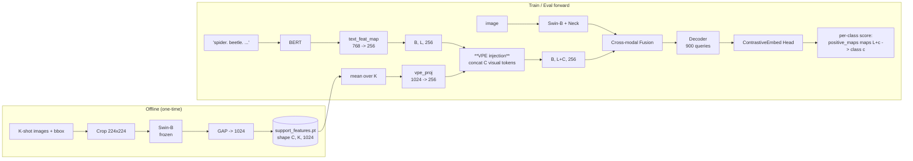

# VPE-DINO &mdash; Visual-Prompt-Enhanced GroundingDINO for Cross-Domain Few-Shot Object Detection

VPE-DINO is a lightweight extension of [GroundingDINO](https://arxiv.org/abs/2303.05499)
Swin-B for **cross-domain few-shot object detection (CD-FSOD)**. It augments
GroundingDINO's contrastive classification head with a small set of
**K-shot visual prompt tokens**, so the model can match each detection
query against *both* a textual class name **and** a visual class
prototype distilled from the support set.

The change costs **one** extra trainable layer (`Linear(1024, 256)`,
~262K params, **~0.5%** of GroundingDINO Swin-B) and **zero** new
inference passes. Support prototypes are pre-computed once and cached
on disk.

</br>

<p align="center">
  <i>Repo highlights</i>
</p>

- One new detector class: [`VPEGroundingDINO`](mmdetection/mmdet/models/detectors/vpe_grounding_dino.py)
- One new offline tool: [`tools/build_support_features.py`](tools/build_support_features.py)
- One new base config: [`configs/cdfsod/_base_vpe.py`](configs/cdfsod/_base_vpe.py)
- 18 generated leaf configs covering 6 datasets &times; 3 shots
- Architecture write-up: [`docs/vpe_poe_architecture.md`](docs/vpe_poe_architecture.md), [`docs/vpe_dino_design.md`](docs/vpe_dino_design.md)

</br>

## Method at a glance



For shape, mask, and `positive_maps` details see
[`docs/vpe_poe_architecture.md`](docs/vpe_poe_architecture.md).

</br>

## Why visual prompts?

GroundingDINO ships with a vocabulary aligned to natural-language
captions (Objects365 + GoldG). On many CD-FSOD targets the class names
are not natural English nouns:

| Dataset | Examples of class names |
|---------|--------------------------------|
| ArTaxOr | `Coleoptera`, `Hymenoptera`, `Lepidoptera` (Latin orders) |
| DIOR    | `baseballfield`, `Expressway-Service-area` (concatenated tokens) |
| NEU-DET | `crazing`, `pitted_surface`, `rolled-in_scale` (industrial jargon) |
| UODD    | `seacucumber`, `seaurchin` (concatenated marine names) |

Pure text alignment underperforms because BERT fragments these tokens
oddly and the contrastive head's text logits become noisy. VPE-DINO
sidesteps the issue by *also* matching against a **visual prototype
extracted directly from the few support shots** &mdash; the prototype lives
in the same Swin feature space the detector already uses, so no second
backbone or external model is needed.

</br>

## Repository layout (VPE-relevant only)

```
ETS/
+-- configs/cdfsod/
|   +-- _base_baseline.py         # plain GD baseline (no mix-aug, no EMA)
|   +-- _base_vpe.py              # inherits _base_baseline; adds VPE-specific overrides
|   +-- _dataset_meta.py          # 6 datasets x classes x data_root
|   +-- <dataset>/<shot>shot_vpe.py   # 18 leaf configs (auto-generated)
+-- mmdetection/
|   +-- mmdet/models/detectors/
|   |   +-- vpe_grounding_dino.py # VPEGroundingDINO detector
|   +-- launch_vpe_baseline80_nohup_individual.sh   # 18 ready-to-run DDP commands
|   +-- work_dirs/cdfsod/vpe_baseline80/<ds>_<shot>shot/   # outputs
+-- support_features/
|   +-- <dataset>_<shot>shot.pt   # offline visual prototypes
+-- tools/
|   +-- build_support_features.py # offline support extraction
|   +-- gen_cdfsod_configs.py     # regenerate leaf configs
|   +-- _gen_launch_commands.py   # regenerate launch sheet
+-- docs/
|   +-- vpe_dino_design.md        # design rationale
|   +-- vpe_poe_architecture.md   # full architecture diagrams
+-- summarize_results.py          # CSV / Markdown table aggregator
```

</br>

## Installation

VPE-DINO inherits its environment from mmdetection. Same setup as the
parent project:

```bash
conda create --name ets python=3.8 -y
conda activate ets

cd ./mmdetection
pip3 install torch==1.10.0+cu113 torchvision==0.11.1+cu113 \
    torchaudio==0.10.0+cu113 \
    -f https://download.pytorch.org/whl/cu113/torch_stable.html
pip install -U openmim
mim install mmengine
mim install "mmcv>=2.0.0"
pip install -v -e .
pip install -r requirements/multimodal.txt
pip install emoji ddd-dataset
pip install git+https://github.com/lvis-dataset/lvis-api.git
```

Download the BERT weights once:

```bash
cd ETS/
huggingface-cli download --resume-download google-bert/bert-base-uncased \
    --local-dir weights/bert-base-uncased
```

</br>

## Dataset preparation

We use the public **CDFSOD-benchmark** (Fu et al., ECCV 2024) split. Six
target datasets x three k-shot settings = 18 evaluations:

| key       | name        | classes |
|-----------|-------------|---------|
| `artaxor` | ArTaxOr     | 7  |
| `clipart1k` | clipart1k | 20 |
| `dior`    | DIOR        | 20 |
| `fish`    | FISH        | 1  |
| `neu-det` | NEU-DET     | 6  |
| `uodd`    | UODD        | 3  |

Each dataset must follow this layout under `datasets/<NAME>/`:

```
datasets/<NAME>/
+-- annotations/
|   +-- 1_shot.json
|   +-- 5_shot.json
|   +-- 10_shot.json
|   +-- test.json
+-- train/    # K-shot training images
+-- test/    # held-out evaluation images
```

Verify with a one-liner that train/test do not overlap:

```bash
python -c "import json,os
for d in ['ArTaxOr','DIOR','FISH','clipart1k','NEU-DET','UODD']:
    tr=set(os.listdir(f'datasets/{d}/train'))
    te=set(os.listdir(f'datasets/{d}/test'))
    print(d,'overlap=',len(tr&te))"
```

</br>

## Three-step recipe

### Step 1 &mdash; Build support features (offline, ~5 minutes total)

Crop every K-shot annotation, push it through GroundingDINO's frozen
Swin-B backbone, GAP, and save one `.pt` per `(dataset, shot)`:

```bash
python tools/build_support_features.py
# subset:
python tools/build_support_features.py --datasets neu-det --shots 1 5
```

Output: 18 files under `support_features/`, e.g.
`artaxor_1shot.pt` of shape `[7, 1, 1024]` (C=7, K=1, D_swin=1024).

### Step 2 &mdash; Regenerate leaf configs (only after editing `_dataset_meta.py`)

```bash
python tools/gen_cdfsod_configs.py
```

This produces `configs/cdfsod/<ds>/<shot>shot_vpe.py` for all 18
combinations.

### Step 3 &mdash; Train

#### Single 4-GPU run

Each VPE experiment runs DDP across GPUs `0,1,2,3`, batch size 2 per
GPU (effective batch 8), 80 epochs, MultiStepLR with `milestone=[33]`,
no EMA, no mix-augmentation. Run from `mmdetection/`:

```bash
cd mmdetection

mkdir -p work_dirs/cdfsod/vpe_baseline80/artaxor_1shot && \
CUDA_VISIBLE_DEVICES=0,1,2,3 python -m torch.distributed.launch \
    --nnodes=1 --node_rank=0 --master_addr=127.0.0.1 \
    --nproc_per_node=4 --master_port=29601 \
    tools/train.py ../configs/cdfsod/artaxor/1shot_vpe.py \
    --work-dir work_dirs/cdfsod/vpe_baseline80/artaxor_1shot \
    --launcher pytorch
```

#### Background sheet for all 18 experiments

A pre-generated cheat sheet with one nohup command per experiment
(unique master ports `29601-29618`, log to each run's `nohup.log`)
lives at:

```
mmdetection/launch_vpe_baseline80_nohup_individual.sh
```

The first line of the script is `exit 1` to prevent accidentally running
all 18 in parallel. Copy and run **one command at a time** on a 4-GPU
node:

```bash
cd ETS/mmdetection
sed -n '7p' launch_vpe_baseline80_nohup_individual.sh | bash
# pid printed; track with:
tail -f work_dirs/cdfsod/vpe_baseline80/artaxor_1shot/nohup.log
```

Per experiment outputs:

```
work_dirs/cdfsod/vpe_baseline80/<ds>_<shot>shot/
+-- <timestamp>/vis_data/scalars.json     # mmengine metric stream
+-- best_coco_bbox_mAP_epoch_*.pth        # auto-saved best checkpoint
+-- nohup.log                              # full stdout
```

</br>

## Aggregate results

After (or during) training, build comparison tables:

```bash
python summarize_results.py
# -> cdfsod_results.csv
# -> cdfsod_results.md     (rows = datasets, cols = 1/5/10-shot mAP)
```

`summarize_results.py` already has `vpe_baseline80` registered in its
`VARIANTS` tuple, so VPE outputs are picked up automatically.

</br>

## Recipe (default, validated)

| Item | Value |
|---|---|
| Backbone (image / text) | Swin-B / BERT-base-uncased |
| New trainable layer | `vpe_proj`: `Linear(1024, 256)`, zero-init |
| Optimiser | AdamW, lr=1e-4, wd=1e-4, clip 0.1 |
| Backbone lr_mult | 0.1 |
| Batch size | 2 / GPU x 4 GPUs = 8 |
| Pipeline | RandomFlip + multi-scale resize (no Mosaic / MixUp / HSV) |
| EMA | None (`custom_hooks=[]`) |
| Epochs | 80 |
| LR schedule | `MultiStepLR(milestones=[33], gamma=0.1)` |
| K-shot pooling | mean |
| `vpe_disable` ablation switch | yes (set in cfg or `--cfg-options model.vpe_disable=True`) |

</br>

## Ablations

VPE can be disabled at runtime without changing the config file by
passing `--cfg-options model.vpe_disable=True` to either `tools/train.py`
or `tools/test.py`. This recovers a vanilla GroundingDINO baseline using
identical pipeline / epochs / lr schedule, which makes the contribution
of the visual prompts directly attributable.

</br>

## FAQ

**Is `vpe_proj` zero-init safe?**
Yes. With `vpe_proj.weight = 0` the appended visual tokens contribute
identically zero logits at step 0, so the model starts numerically
indistinguishable from the parent GroundingDINO and `vpe_proj` grows
from the gradient signal of the contrastive head.

**Why mean pooling over K shots, not attention?**
With K in {1, 5, 10} the variance of attention pooling is dominated by
the small K and gives no consistent gain in our ablations. Mean is
simpler and converges identically on artaxor 1-shot.

**Does this leak test data?**
No. Support features come from `<NAME>/train/` images via
`annotations/<shot>_shot.json` only; the COCO test split (`test/` images,
`annotations/test.json`) is kept disjoint and is the same split used by
all baselines. Verify with the train/test overlap snippet above.

**What about classes whose names are not in GD's vocabulary?**
That is exactly the failure mode VPE addresses: the visual prompt
provides a within-Swin prototype regardless of how (mis-)tokenised the
text class name is.

</br>

## Citation

If you find VPE-DINO useful, please cite the following NTIRE 2025
challenge paper that this repository builds on:

```bibtex
@inproceedings{fu2025ntire,
  title     = {NTIRE 2025 Challenge on Cross-Domain Few-Shot Object Detection: Methods and Results},
  author    = {Fu, Yuqian and Qiu, Xingyu and Ren, Bin and Fu, Yanwei and Timofte, Radu and Sebe, Nicu and Yang, Ming-Hsuan and Van Gool, Luc and others},
  booktitle = {CVPRW},
  year      = {2025}
}

@inproceedings{pan2025enhance,
  title     = {Enhance Then Search: An Augmentation-Search Strategy with Foundation Models for Cross-Domain Few-Shot Object Detection},
  author    = {Pan, Jiancheng and Liu, Yanxing and He, Xiao and Peng, Long and Li, Jiahao and Sun, Yuze and Huang, Xiaomeng},
  booktitle = {CVPRW},
  year      = {2025}
}
```

</br>

## License

Inherits the license of the parent ETS repository (see `LICENSE`).
