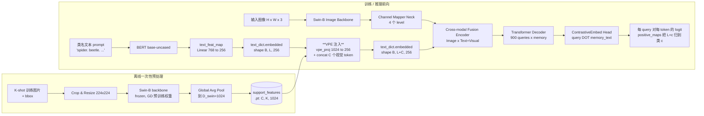
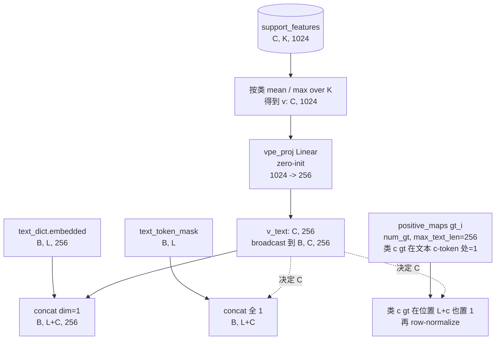
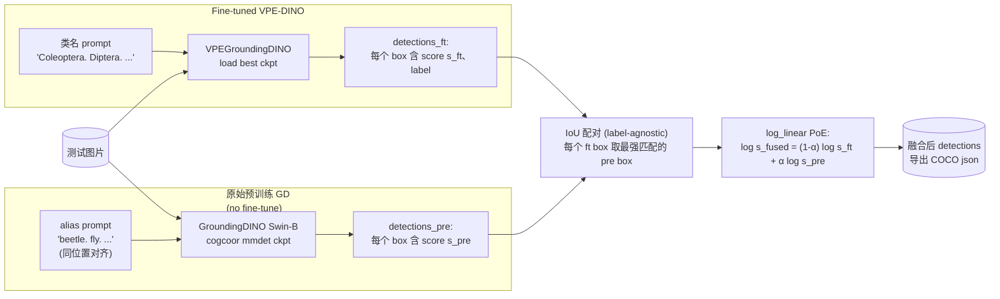

# VPE-DINO + PoE 架构总览

本图描述当前 ETS 仓库中相对于原始 **GroundingDINO Swin-B** 的两处改进：

1. **训练侧 / VPE-DINO**：在 `text_feat_map` 之后，向语言流末尾注入 K-shot **视觉 prompt token**，让对比头同时利用文本相似度与视觉相似度。
2. **推理侧 / PoE**：用 fine-tuned 模型与原始预训练 GD（可选用英文俗名 alias prompt）做 score-fusion。

代码入口：

- 模型：`mmdetection/mmdet/models/detectors/vpe_grounding_dino.py`
- 离线 support：`tools/build_support_features.py`
- 推理融合：`tools/poe_inference.py` / `tools/poe_run_all.py`
- alias 词表：`configs/cdfsod/_dataset_meta.py`

---

## 1. 端到端总览



---

## 2. VPE 注入细节（shape 与流程）



> 约束：必须 `L + C <= 256` (`max_text_len`)。当前 6 个数据集最大 DIOR `C=20, L≈100`，远低于 256。

---

## 3. 训练前向中的注入位置（代码对照）

```text
GroundingDINO.loss(...)                                  # 父类
  ├─ language_model(text_prompts)                       # BERT
  ├─ text_feat_map(...)                                  # Linear 768 -> 256
  │
  │   <<<<<<<<<<<<<  VPE-DINO 注入点  >>>>>>>>>>>>>>>
  │   if support_features 已加载:
  │     v = vpe_proj(mean_K(support_features))   # [B, C, 256]
  │     text_dict['embedded'] = cat([emb, v])    # [B, L+C, 256]
  │     text_token_mask、position_ids、masks 同步扩展
  │     positive_maps[c-th gt][L+c] = 1, row-normalize
  │
  ├─ extract_feat(image)                                # Swin-B + Neck
  ├─ forward_transformer(visual, text_dict, ...)        # 不改
  └─ bbox_head.loss(...)                                # 不改
```

唯一新增可训练参数：`vpe_proj = nn.Linear(1024, 256)`，~262K，**zero-init** 保证训练第 0 步退化为原始 GD。

---

## 4. PoE 推理融合（可选）



支持的 fusion 模式：

| `--mode` | 公式 | 备注 |
|---|---|---|
| `log_linear` | `s_ft^(1-α) * s_pre^α` | 默认 / 严格 PoE |
| `multiplicative` | `s_ft * (1 + α * s_pre)` | 较温和 |
| `additive` | `(1-α) s_ft + α s_pre` | 不是 PoE，是 MoE |
| `gated` | `s_ft + α * 1[s_pre>τ] * s_pre` | 阈值开关 |

---

## 5. 数据流（一行总结）

```text
[K-shot crops] --Swin--> [C, K, 1024] --mean+vpe_proj--> [C, 256]
                                                          |
[image]   --Swin/Neck--> [4-level feats]                  |
                            \                             |
                             \---> Cross-modal Fusion <---/
                                          |
[text]    --BERT/Map--> [L, 256] -- concat ----------> [L+C, 256]
                                          |
                                       Decoder (900 queries)
                                          |
                                ContrastiveEmbed Head
                                          |
                          per-class score = max_token_in_class(query·memory_text)
```

---

## 6. 改进点与原始 GD 的差异

| 模块 | 原始 GroundingDINO | 当前改进版 |
|---|---|---|
| Image Backbone | Swin-B | 同上（不变） |
| Text Encoder | BERT-base | 同上（不变） |
| 文本投影 | `text_feat_map` Linear 768→256 | 同上 |
| **文本 token 数** | L（来自 prompt 分词） | **L + C**（追加 C 个视觉 prompt） |
| **新增可训练参数** | 0 | `vpe_proj` Linear(1024,256) ≈ 262K |
| Cross-modal Fusion / Decoder / Head | 不变 | 不变 |
| `positive_maps` | 仅文本 token 位置 | **额外** 在位置 `L+c` 置 1 |
| 推理融合 | 单模型 | **可选** PoE：fine-tuned ⊗ 预训练（alias prompt） |

---

## 7. 关键设计选择小抄

- **Backbone 复用**：visual prompt 用 GD 自带 Swin-B 提特征，零额外 backbone 参数，特征空间天然对齐。
- **离线预提取**：support feature 一次性算好存 `.pt`，训练循环里只走 `vpe_proj`，速度几乎与 baseline 持平。
- **Zero-init 投影**：`vpe_proj` 初始化为 0，第 0 步 `cls_logits` 与原 GD 完全一致，避免冷启动崩。
- **mean over K**：K 小时方差大，attention pool 收益有限；mean 简单且稳。
- **mask 全互通**：visual prompt 不参与 GD 原本的 category-chunk 隔离，简化 bookkeeping。
- **PoE alias prompt**：解决 GD 预训练词表（Objects365 + GoldG）对拉丁学名 / 拼接词的支持空洞，按位置对齐 ft / pre 的类 ID。
